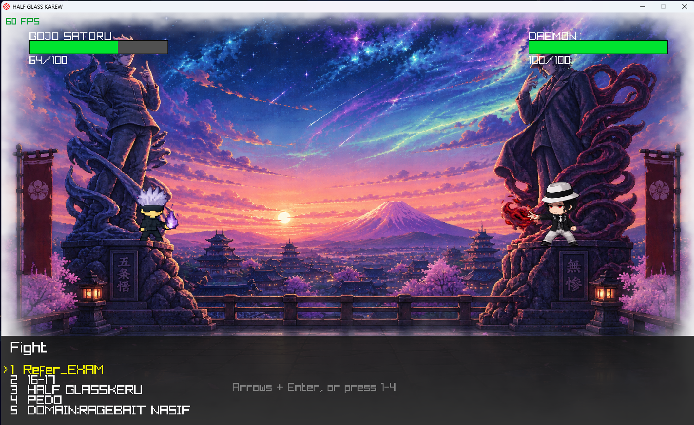
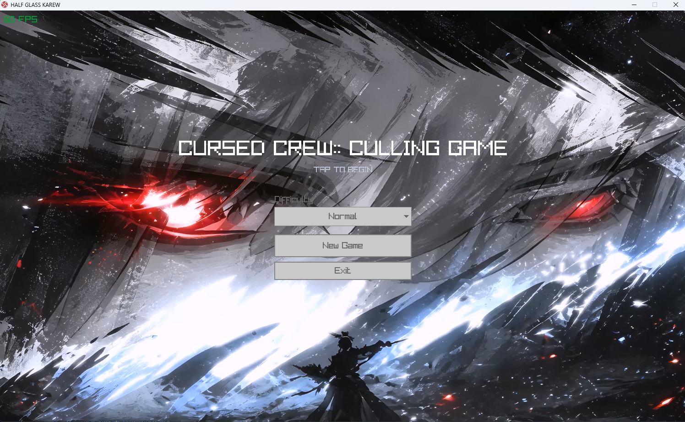
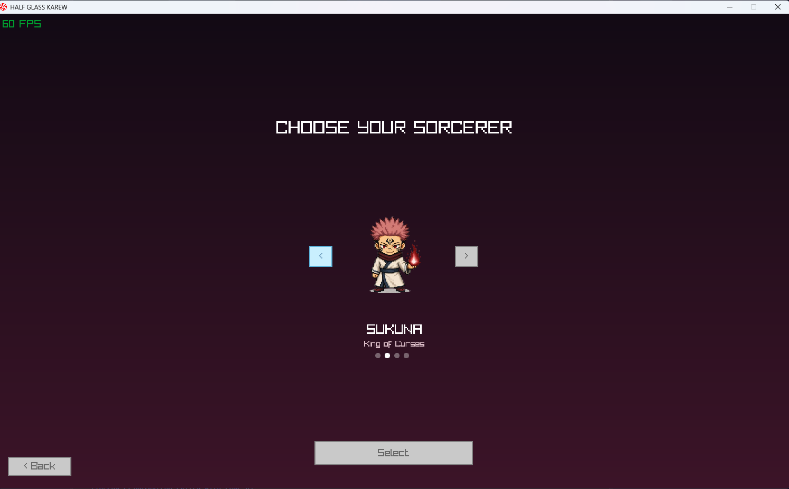
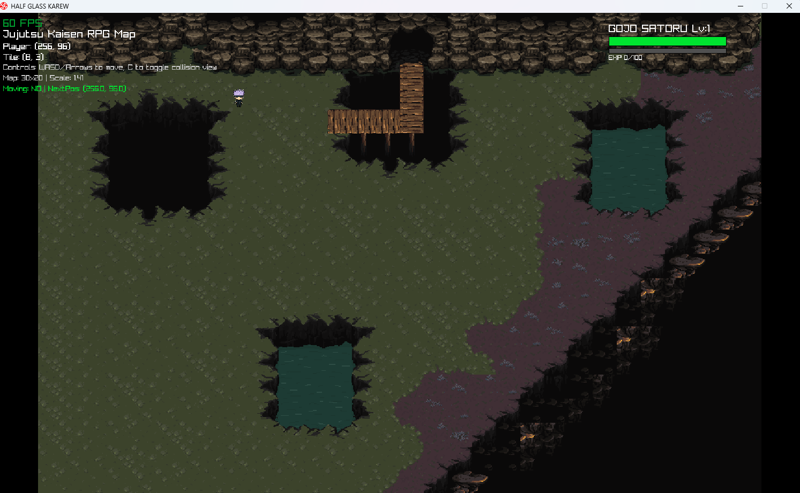
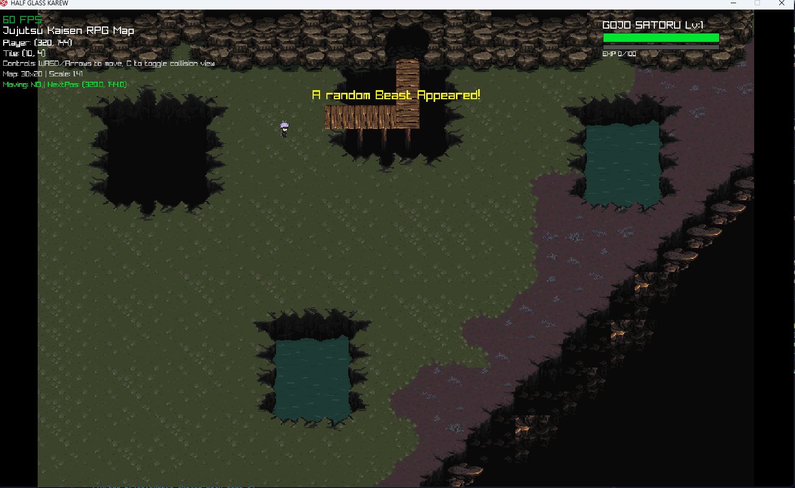
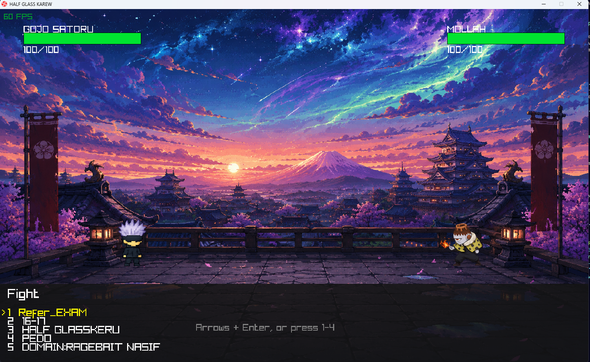
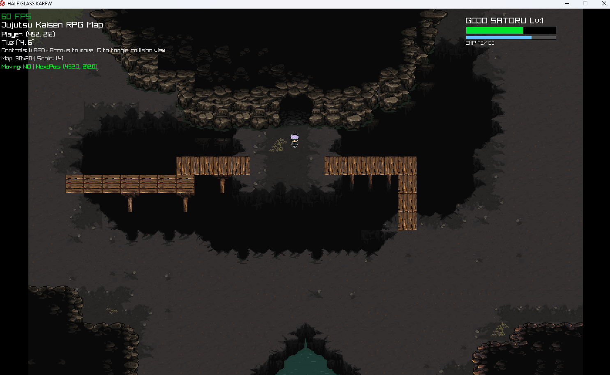
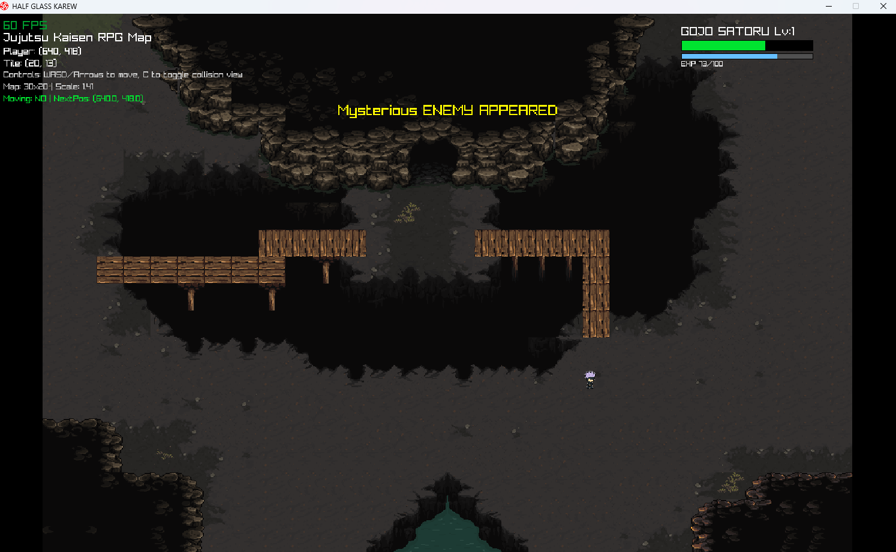

<div align="center">

# ⚡ HALF GLASS KAREW
### Cursed Crew :: Culling Game

*A Jujutsu Kaisen–inspired 2D RPG, built from scratch in C with raylib.*




</div>

---

## 🎮 About

**Half Glass Karew** drops you into a Jujutsu Kaisen–style Culling Game: pick your sorcerer, explore a hand-crafted overworld, descend into a cursed cave, and fight your way through random encounters and a climactic boss battle — all rendered with a custom tile engine and a Pokémon-style turn-based combat system written entirely in C.

No game engine, no visual scripting — just raylib, a hand-rolled Tiled `.tmj` parser, and a state-machine battle system built from the ground up.

---

## 🖼️ Preview

<table>
<tr>
<td width="50%">
<p align="center"><b>Main Menu</b></p>

</td>
<td width="50%">
<p align="center"><b>Choose Your Sorcerer</b></p>

</td>
</tr>
<tr>
<td width="50%">
<p align="center"><b>Overworld Exploration</b></p>

</td>
<td width="50%">
<p align="center"><b>Random Encounters</b></p>

</td>
</tr>
<tr>
<td width="50%">
<p align="center"><b>Turn-Based Battles</b></p>

</td>
<td width="50%">
<p align="center"><b>The Cursed Cave</b></p>

</td>
</tr>
<tr>
<td width="50%">
<p align="center"><b>Something's Watching...</b></p>

</td>
<td width="50%">
<p align="center"><b>Boss Showdown</b></p>

</td>
</tr>
</table>

---

## ✨ Features

- 🎬 **Animated main menu** with a video background and difficulty selector
- 🥷 **Character select carousel** — Gojo, Sukuna, Megumi, Nobara
- 🗺️ **Custom tile engine** — overworld and cave maps built in Tiled, with collision, teleport, encounter, exit, and heal layers
- 👻 **Random encounters** that scale between a regular enemy pool and a dedicated boss-battle pool in the cave
- ⚔️ **Full turn-based battle engine** — move selection menu, animated HP bars, hit-flash feedback, sprite-sheet animation, and win/lose flow
- 🐉 **A parallel boss battle system** that runs alongside the regular engine without stepping on its types or state
- 📈 **Persistent player stats** — HP, level, and scaling EXP with a live in-game HUD
- 🧩 **Zero external JSON dependency** — Tiled `.tmj` maps are parsed with a lightweight hand-written parser

---

## 🕹️ Controls

| Action | Key |
|---|---|
| Move | `WASD` / Arrow Keys |
| Confirm / Advance | `Enter` |
| Select move in battle | `1`–`4`, or Arrow Keys + `Enter` |
| Trigger encounter | `Space` |
| Toggle collision debug view | `C` |
| Exit cave (fallback) | `Backspace` |

---

## 🛠️ Building from source

**Requirements**
- A C99-capable compiler (developed with MinGW on Windows)
- [raylib](https://www.raylib.com/)

```bash
gcc MAINGAME.c -o game.exe -I include -L lib -lraylib -lopengl32 -lgdi32 -lwinmm
./game.exe
```

> Adjust the include/lib paths to wherever raylib is installed on your machine.

---

## 📂 Project structure

```
MAINGAME.c              entry point — unity-build root, game loop, mode switching
headerfiles/
 ├─ character.c          player movement & animation
 ├─ charselect.c         character selection screen
 ├─ tiled.c / .h         tile rendering, viewport scaling, debug UI
 ├─ mapcollision.c / .h  collision checks, encounters, map switching
 ├─ menu.c               main menu + video background
 ├─ battle.c / .h        regular random-encounter battle engine
 ├─ bossbattle.c / .h    boss battle engine (Boss-prefixed types)
 ├─ playerstats.c / .h   level, EXP, HP tracking + HUD
 └─ gamemode.h           shared GameMode enum
json_parser.h            minimal .tmj (Tiled JSON) parser
Assets&resources/        sprites, backgrounds, video, icons
assets/                  Tiled map files (.tmj) and tilesets
```

This project compiles as a **single-translation-unit build** — `MAINGAME.c` `#include`s every other `.c` file directly. Struct, enum, and macro names must stay unique across the whole codebase; the boss battle engine uses a distinct `Boss`/`BOSS` naming convention for exactly this reason.

---

## 🧭 Roadmap

- [ ] Support multiple simultaneous enemies in battle
- [ ] Let Enter dismiss a cave encounter, matching overworld behavior
- [ ] Wire up `exitLayerIndex` fully through map switching
- [ ] Add more sorcerers and boss templates

---

<div align="center">

*Built with 🖤 and raylib.*
*BY SYED TOSHRIF ALAM and team*
</div>